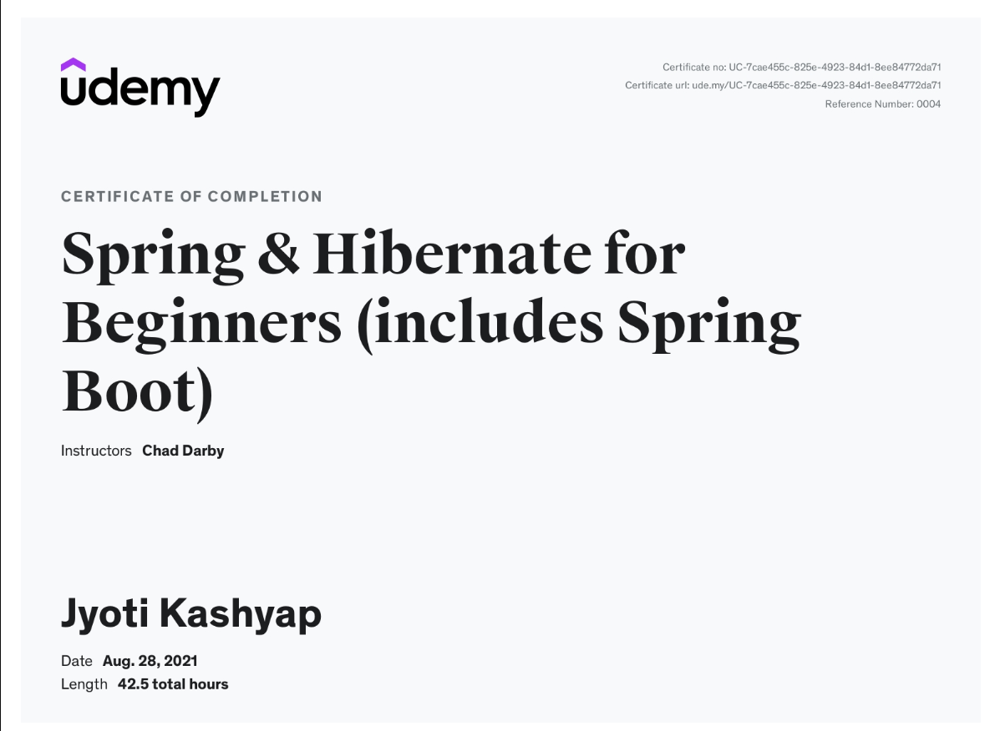
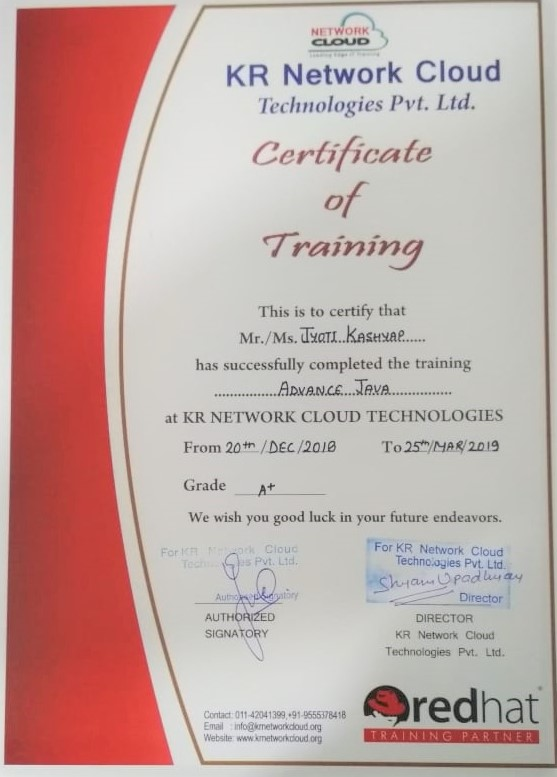

### Welcome  👋
- 🔭 I’m **SOFTWARE ENGINEER (WEB DEV)**
- 🌱 Working On Java, Spring Boot,Spring MVC, J2EE,Hibernate,JUnit&Mockito,Microservices, Java Messaging System Apache Kafka, MongoDB, Elastic Search, Kibana etc
---
### Licenses & Certifications
-  
- 👯 Spring Boot And Hibernate Framework **Udemy**
-  
- 👯 Advanced Java **KR Network Cloud**
---
### Education
- 🌱 Guru Gobind Indraprastha Univeristy **B.Tech (2016-2020)**
- 🔭Kendriya Vidyalaya AGCR Colony **Senior Education**
---
### Contact
- [ ] You can reach out to me @jyotikas1608@gmail.com
- [ ] [Connect Me @LinkedIn](https://www.linkedin.com/in/jyoti-kashyap/)

---
<!--
**jyotik16/jyotik16** is a ✨ _special_ ✨ repository because its `README.md` (this file) appears on your GitHub profile.

Here are some ideas to get you started:

- 🔭 I’m currently working on ...
- 🌱 I’m currently learning ...
- 👯 I’m looking to collaborate on ...
- 🤔 I’m looking for help with ...
- 💬 Ask me about ...
- 📫 How to reach me: ...
- 😄 Pronouns: ...
- ⚡ Fun fact: ...

-->
